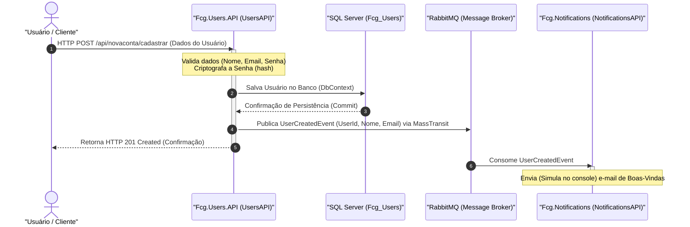

# Fiap Cloud Games (FCG) - Usuário API

Este microsserviço é responsável por toda a **gestão de identidade, autenticação e autorização** da plataforma **Fiap Cloud Games (FCG)**. Desenvolvido com **.NET 9** e estruturado seguindo os princípios de **Clean Architecture** e **Domain-Driven Design (DDD)**, o projeto garante robustez, segurança e manutenibilidade para as operações de cadastro de usuários, autenticação via tokens JWT e controle de perfis.

---

## 🔐 Credenciais de Teste (Admin)

Para facilitar a avaliação das funcionalidades administrativas (como a criação de jogos, jogadores e promoções), utilize o usuário pré-configurado:

*   E-mail: admin@fiapcloudgames.com.br

*   Senha: SenhaAdmin@123

Nota: Realize o login no endpoint /login para obter o Token JWT e utilize o botão Authorize do Swagger para enviar o cabeçalho de autorização.

---

---

## 🛠️ Tecnologias e Bibliotecas

A API faz uso das seguintes tecnologias e pacotes:

- **.NET 9.0**: Plataforma de desenvolvimento principal.
- **Entity Framework Core 9.0**: ORM para persistência dos dados no **SQL Server**.
- **MediatR (v14)**: Implementação do padrão Mediator para suporte a **CQRS** (Command Query Responsibility Segregation).
- **AutoMapper (v12)**: Mapeamento de objetos entre Entidades de Domínio e DTOs.
- **BCrypt.Net-Next**: Hashing seguro e criptografia de senhas dos usuários.
- **System.IdentityModel.Tokens.Jwt**: Criação e manipulação de JSON Web Tokens (JWT) para autenticação.
- **xUnit**: Framework para execução de testes de unidade e integração.

---

## 🏗️ Arquitetura da Solução

O projeto está estruturado em camadas para separar responsabilidades de forma clara e evitar acoplamento:

```
src/
├── Fcg.Users.Domain         # Regras de Negócio, Entidades de Domínio e Invariantes
├── Fcg.Users.Application    # Casos de Uso (Commands/Queries), DTOs e Handlers (MediatR)
├── Fcg.Users.Infrastructure # Persistência de Dados, Configuração de Segurança e Serviços Externos
└── Fcg.Users.API            # Host da API HTTP, Middlewares e Ponto de Entrada (Program.cs)
```

### Detalhamento das Camadas

#### 1. `Fcg.Users.Domain` (Domínio)
Contém o coração da regra de negócio, livre de dependências de frameworks externos:
- **Entidades**: O agregado raiz `User`, que encapsula o comportamento do usuário e do ciclo de vida da conta.
- **Objetos de Valor (Value Objects)**: `Nome`, `Email` e `Senha`, com auto-validação das suas respectivas regras no construtor.
- **Validações**: `AssertionConcern` para validar dados de entrada de forma consistente.
- **Repositórios**: A interface `IUserRepository`, que define os contratos de banco de dados a serem implementados pela infraestrutura.
- **Enums**: Definição de perfis (`Administrador`, `Jogador`) e motivos de desativação (`MotivoDesativacao`).

#### 2. `Fcg.Users.Application` (Aplicação)
Orquestra os fluxos de dados e implementa os casos de uso usando **CQRS**:
- **Commands & Queries**: Separados por escopo (ex.: `CadastrarUserCommand`, `ObterUserPorIdQuery`), convertidos em **C# records** para imutabilidade.
- **Handlers**: Processam os comandos e consultas via `IRequestHandler` do MediatR.
- **DTOs**: Estruturas de requisição e resposta expostas externamente (ex.: `CriaUserRequest`, `UserResponse`).
- **Interfaces**: Definição de serviços utilitários como `ITokenService`.

#### 3. `Fcg.Users.Infrastructure` (Infraestrutura)
Lida com preocupações transversais, frameworks e infraestrutura técnica:
- **Persistência**: Implementação do `UserDbContext` configurado via EF Core, utilizando mapeamento fluente (`UserConfiguration`).
- **Segurança**:
  - `PasswordHasher`: Responsável por gerar hashes seguros usando BCrypt e comparar senhas.
  - `TokenService`: Gera tokens JWT com claims de identidade e perfis (`AdminRole`, `JogadorRole`).
- **Repositórios Concretos**: Implementação da persistência de dados em `UserRepository`.

#### 4. `Fcg.Users.API` (Apresentação)
O ponto de partida da aplicação responsável pelo bootstrap e exposição dos serviços HTTP.

---

## 🚀 Funcionalidades Principais (Casos de Uso)

O microsserviço gerencia todo o ciclo de vida do usuário:

1. **Cadastro de Usuário (`CadastrarUserCommand`)**: Permite que novos jogadores se cadastrem com e-mail, nome e senha.
2. **Autenticação (`AutenticarUserCommand`)**: Valida credenciais do usuário e retorna um token JWT ativo.
3. **Gerenciamento de Perfis**:
   - Promover Jogador a Administrador (`PromoverUserParaAdminCommand`).
   - Rebaixar Administrador a Jogador (`RebaixarUserParaJogadorCommand`).
4. **Atualização de Cadastro (`AtualizarUserCommand`)**: Altera nome e/ou senha do usuário logado.
5. **Ciclo de Conta (Ativo / Inativo)**:
   - Desativação de conta pelo próprio usuário (`DesativarContaCommand`).
   - Desativação de conta por um Administrador, informando o motivo (`DesativarUserCommand`).
   - Reativação de conta previamente desativada (`ReativarContaCommand`).
6. **Consultas (Queries)**:
   - Obter detalhes de um usuário por ID (`ObterUserPorIdQuery`).
   - Listar todos os usuários cadastrados (`ObterTodosUsersQuery`).

---

## 📐 Fluxo de Integração (Tech Challenge)

Conforme os requisitos do **Tech Challenge**, o fluxo de cadastro de novos usuários é orientado a eventos e se integra de forma assíncrona com o serviço de notificações:



---

## ⚙️ Configuração e Execução

### Pré-requisitos
- SDK do [.NET 9.0](https://dotnet.microsoft.com/download/dotnet/9.0) instalado.
- Banco de dados SQL Server acessível.

### Configuração
No arquivo `appsettings.json` (ou `appsettings.Development.json`) do projeto `Fcg.Users.API`, certifique-se de configurar a connection string e os parâmetros de segurança do token JWT:

```json
{
  "ConnectionStrings": {
    "DefaultConnection": "Server=SEU_SERVIDOR;Database=FcgUsersDb;Trusted_Connection=True;TrustServerCertificate=True;"
  },
  "JwtSettings": {
    "Secret": "SUA_CHAVE_SUPER_SECRETA_E_LONGA_DE_EXEMPLO",
    "Emissor": "Fcg.Users.API",
    "ValidoEm": "FiapCloudGames",
    "ExpiracaoHoras": 2
  }
}
```

### Comandos Úteis

#### Restaurar dependências e compilar a solução:
```bash
dotnet restore
dotnet build
```

#### Aplicar migrações do Entity Framework Core:
```bash
# Executar a partir da raiz do repositório
dotnet ef database update --project src/Fcg.Users.Infrastructure/ --startup-project src/Fcg.Users.API/
```

#### Executar a API localmente:
```bash
dotnet run --project src/Fcg.Users.API/
```

Após iniciar, acesse os endpoints de documentação do Swagger/OpenAPI configurados no ambiente de desenvolvimento.

---

## 🧪 Testes

O projeto contém suítes de testes automatizados organizadas na pasta `/tests`:

- **Testes de Domínio (`Fcg.Users.Domain.Tests`)**: Validações de invariantes de negócio na entidade `User` e nos Value Objects.
- **Testes de Aplicação (`Fcg.Users.Application.Tests`)**: Testes de lógica de negócio e comportamento dos handlers de comandos/consultas.
- **Testes de Integração (`Fcg.Users.Infrastructure.Integration`)**: Integração de fluxos com o banco de dados real ou in-memory e serviços de segurança.

Para rodar todos os testes da solução, execute:
```bash
dotnet test
```
